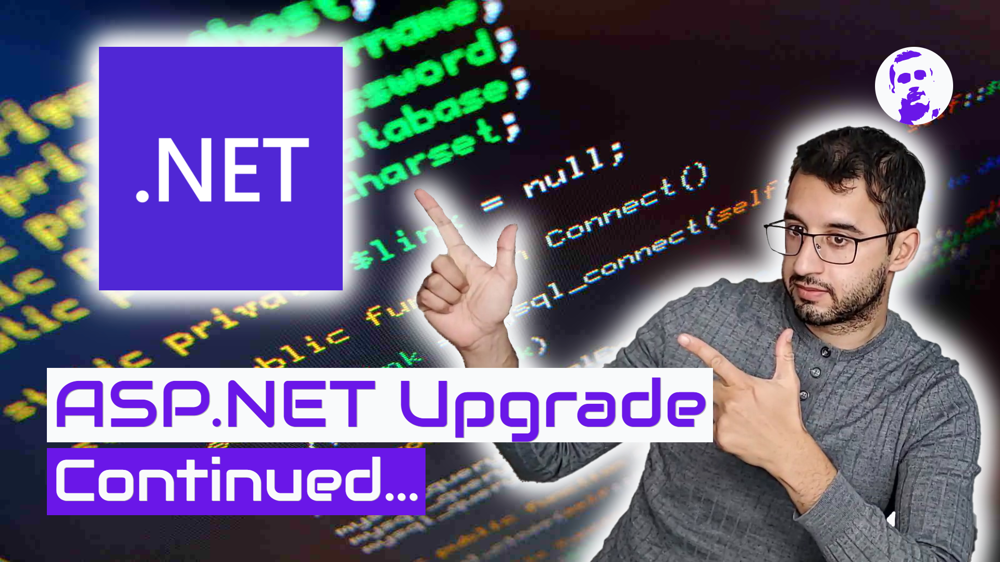
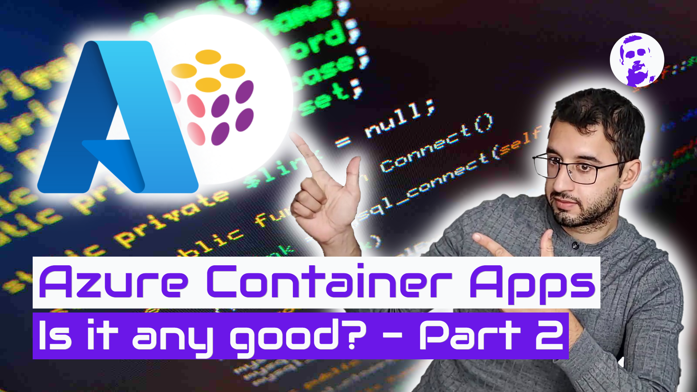
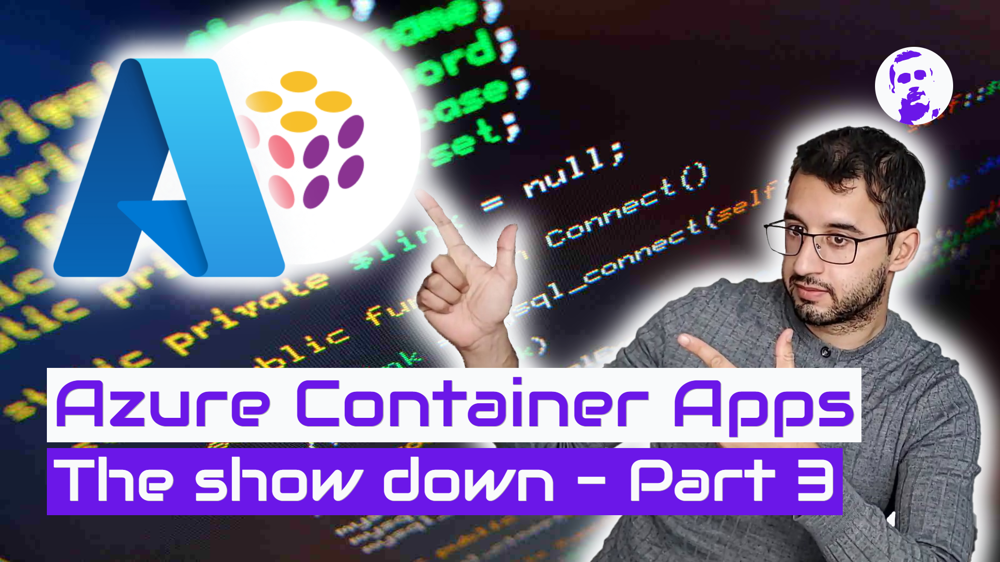
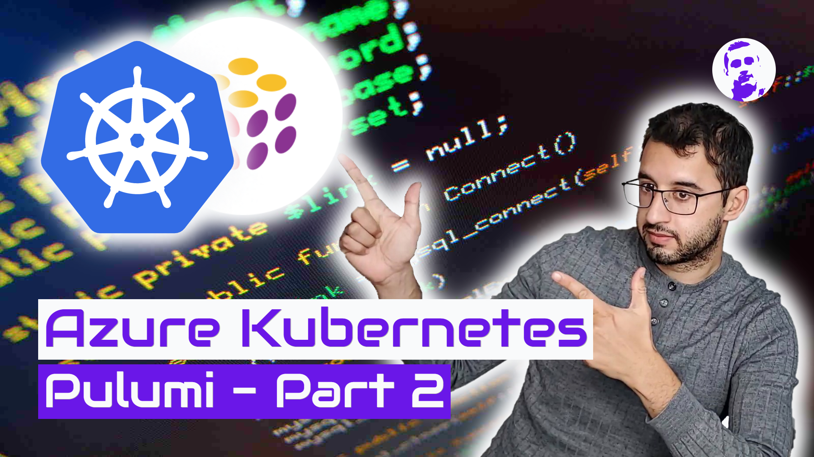

# [2021-10-13-.NET-6-C-10-Upgrade.png](http://localhost:8080/streaming/thumbnail?background=%2Fimages%2Fhero%2FCode-1600x900.jpg&title=.NET%206%20%26%20C%23%2010%20Upgrade&subtitle=Is%20it%20really%20easy%3F&image1=%2Fimages%2Freactions%2FPointing-Left-1099x924.png&image1-width=1099&image1-height=924&image1-x=700&image1-y=150&image2=%2Fimages%2Fitems%2FNET-768x768.png&image2-width=468&image2-height=468&image2-x=100)

# [2021-10-13-Embedded-README's.png](http://localhost:8080/streaming/thumbnail?background=%2Fimages%2Fhero%2FCode-1600x900.jpg&title=Embedded%20README%27s&subtitle=In%20NuGet%20Packages%21&image1=%2Fimages%2Freactions%2FPointing-Left-1099x924.png&image1-width=1099&image1-height=924&image1-x=700&image1-y=150&image2=%2Fimages%2Fitems%2FNET-768x768.png&image2-width=468&image2-height=468&image2-x=100)

# [2021-10-14-ASP.NET-Upgrade.png](http://localhost:8080/streaming/thumbnail?background=%2Fimages%2Fhero%2FCode-1600x900.jpg&title=ASP.NET%20Upgrade&subtitle=Hidden%20Features&image1=%2Fimages%2Freactions%2FPointing-Left-1099x924.png&image1-width=1099&image1-height=924&image1-x=700&image1-y=150&image2=%2Fimages%2Fitems%2FNET-768x768.png&image2-width=468&image2-height=468&image2-x=100)

# [2021-10-15-ASP.NET-Upgrade-Continued.png](http://localhost:8080/streaming/thumbnail?background=%2Fimages%2Fhero%2FCode-1600x900.jpg&title=ASP.NET%20Upgrade&subtitle=Continued...&image1=%2Fimages%2Freactions%2FPointing-Left-1099x924.png&image1-width=1099&image1-height=924&image1-x=700&image1-y=150&image2=%2Fimages%2Fitems%2FNET-768x768.png&image2-width=468&image2-height=468&image2-x=100)

# [2021-10-20-Easily-Switch-To-CSharp-10.png](http://localhost:8080/streaming/thumbnail?background=%2Fimages%2Fhero%2FCode-1600x900.jpg&title=You%20won%27t%20believe%21&subtitle=Easily%20Switch%20to%20C%23%2010&image1=%2Fimages%2Freactions%2FPointing-Left-1099x924.png&image1-width=1099&image1-height=924&image1-x=700&image1-y=150&image2=%2Fimages%2Fitems%2FNET-768x768.png&image2-width=468&image2-height=468&image2-x=100)

# [2021-10-22-ASP-NET-Serialization-40-Faster.png](http://localhost:8080/streaming/thumbnail?background=%2Fimages%2Fhero%2FCode-1600x900.jpg&title=ASP.NET%20Serialization&subtitle=40%25%20Faster%21&image1=%2Fimages%2Freactions%2FPointing-Left-1099x924.png&image1-width=1099&image1-height=924&image1-x=700&image1-y=150&image2=%2Fimages%2Fitems%2FNET-768x768.png&image2-width=468&image2-height=468&image2-x=100)

# [2021-10-27-ASP-NET-New-Host.png](http://localhost:8080/streaming/thumbnail?background=%2Fimages%2Fhero%2FCode-1600x900.jpg&title=ASP.NET%27s%20New%20Host&subtitle=Is%20It%20Better%3F&image1=%2Fimages%2Freactions%2FPointing-Left-1099x924.png&image1-width=1099&image1-height=924&image1-x=700&image1-y=150&image2=%2Fimages%2Fitems%2FNET-768x768.png&image2-width=468&image2-height=468&image2-x=100)

# [2021-11-03-Generating-ID.png](http://localhost:8080/streaming/thumbnail?background=%2Fimages%2Fhero%2FCode-1600x900.jpg&title=Generating%20ID%27s%3F&subtitle=Try%20Twitter%20Snowflake%20ID%27s%21&image1=%2Fimages%2Freactions%2FPointing-Left-1099x924.png&image1-width=1099&image1-height=924&image1-x=700&image1-y=150&image3=%2Fimages%2Fitems%2FTwitter-1350x1200.png&image3-width=468&image3-height=468&image3-x=50&image2=%2Fimages%2Fitems%2FSnowflake-1600x1600.png&image2-width=468&image2-height=468&image2-x=350&image2-y=-100)

# [2021-11-05-Twitter-Snowflake-ID.png](http://localhost:8080/streaming/thumbnail?background=%2Fimages%2Fhero%2FCode-1600x900.jpg&title=Twitter%20Snowflake%EF%B8%8F%20ID%27s&subtitle=%2B%20ASP.NET%20Minimal%20API%3F&image1=%2Fimages%2Freactions%2FPointing-Left-1099x924.png&image1-width=1099&image1-height=924&image1-x=700&image1-y=150&image3=%2Fimages%2Fitems%2FTwitter-1350x1200.png&image3-width=468&image3-height=468&image3-x=50&image2=%2Fimages%2Fitems%2FSnowflake-1600x1600.png&image2-width=468&image2-height=468&image2-x=350&image2-y=-100)

# [2021-11-10-NET-6-Released.png](http://localhost:8080/streaming/thumbnail?background=%2Fimages%2Fhero%2FCode-1600x900.jpg&title=.NET%206%20Released%21&subtitle=ASP.NET%20Updates&image1=%2Fimages%2Freactions%2FPointing-Left-1099x924.png&image1-width=1099&image1-height=924&image1-x=700&image1-y=150&image2=%2Fimages%2Fitems%2FNET-768x768.png&image2-width=468&image2-height=468&image2-x=100)

# [2021-11-17-Azure-Container-Apps.png](http://localhost:8080/streaming/thumbnail?background=%2Fimages%2Fhero%2FCode-1600x900.jpg&title=Azure%20Container%20Apps&subtitle=Is%20it%20any%20good%3F&image1=%2Fimages%2Freactions%2FPointing-Left-1099x924.png&image1-width=1099&image1-height=924&image1-x=700&image1-y=150&image3=%2Fimages%2Fitems%2FAzure-2300x2300.png&image3-width=468&image3-height=468&image3-x=0&image2=%2Fimages%2Fitems%2FPulumi-300x300.png&image2-width=468&image2-height=468&image2-x=250&image2-y=-50)

# [2021-11-19-Azure-Container-Apps-2.png](http://localhost:8080/streaming/thumbnail?background=%2Fimages%2Fhero%2FCode-1600x900.jpg&title=Azure%20Container%20Apps&subtitle=Is%20it%20any%20good%3F%20-%20Part%202&image1=%2Fimages%2Freactions%2FPointing-Left-1099x924.png&image1-width=1099&image1-height=924&image1-x=700&image1-y=150&image3=%2Fimages%2Fitems%2FAzure-2300x2300.png&image3-width=468&image3-height=468&image3-x=0&image2=%2Fimages%2Fitems%2FPulumi-300x300.png&image2-width=468&image2-height=468&image2-x=250&image2-y=-50)

# [2021-11-19-Azure-Container-Apps-3.png](http://localhost:8080/streaming/thumbnail?background=%2Fimages%2Fhero%2FCode-1600x900.jpg&title=Azure%20Container%20Apps&subtitle=The%20show%20down%20-%20Part%203&image1=%2Fimages%2Freactions%2FPointing-Left-1099x924.png&image1-width=1099&image1-height=924&image1-x=700&image1-y=150&image3=%2Fimages%2Fitems%2FAzure-2300x2300.png&image3-width=468&image3-height=468&image3-x=0&image2=%2Fimages%2Fitems%2FPulumi-300x300.png&image2-width=468&image2-height=468&image2-x=250&image2-y=-50)

# [2022-12-01-Azure-Kubernetes.png](http://localhost:8080/streaming/thumbnail?background=%2Fimages%2Fhero%2FCode-1600x900.jpg&title=Azure%20Kubernetes&subtitle=With%20Pulumi%3F&image1=%2Fimages%2Freactions%2FPointing-Left-1099x924.png&image1-width=1099&image1-height=924&image1-x=700&image1-y=150&image3=%2Fimages%2Fitems%2FKubernetes.svg&image3-width=468&image3-height=468&image3-x=0&image2=%2Fimages%2Fitems%2FPulumi-300x300.png&image2-width=468&image2-height=468&image2-x=250&image2-y=-50)

# [2022-02-23-Azure-Kubernetes-2.png](http://localhost:8080/streaming/thumbnail?background=%2Fimages%2Fhero%2FCode-1600x900.jpg&title=Azure%20Kubernetes&subtitle=Pulumi%20-%20Part%202&image1=%2Fimages%2Freactions%2FPointing-Left-1099x924.png&image1-width=1099&image1-height=924&image1-x=700&image1-y=150&image3=%2Fimages%2Fitems%2FKubernetes.svg&image3-width=468&image3-height=468&image3-x=0&image2=%2Fimages%2Fitems%2FPulumi-300x300.png&image2-width=468&image2-height=468&image2-x=250&image2-y=-50)

# [2022-03-01-.NET-Global-Tool.png](http://localhost:8080/streaming/thumbnail?background=%2Fimages%2Fhero%2FCode-1600x900.jpg&title=.NET%20Global%20Tool&subtitle=Lets%20make%20one%21&image1=%2Fimages%2Freactions%2FPointing-Left-1099x924.png&image1-width=1099&image1-height=924&image1-x=700&image1-y=150&image2=%2Fimages%2Fitems%2FNET-768x768.png&image2-width=468&image2-height=468&image2-x=100)

